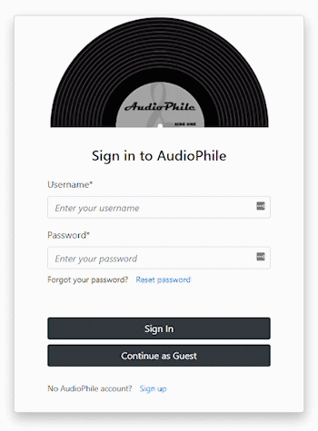

# **AudioPhile**
AudioPhile is a full-stack, multi-page web application to help users manage their physical music collection. Utilizes external APIs and an integrated backend environment that allows users to create an account, sign in, search for albums, and build a personalized collection and wish list.

 

## **Demo**
Here is a working, live demo: https://master.d83yjx4iytzwo.amplifyapp.com/
  

## **Features**
--- 
### **Search**
Users can search for an artist, album, or the combination of an artist and album. Results are paginated and include master release versions of an artist's album collection or master release versions of an individual album. Feature uses the Discogs RESTful API Search endpoint. Requests resolve to a JSON-formatted object that is rendered on the search UI component.

### **Album Master Release Version Details**
Users can click an album master release version in the search UI component to render album details including format, genre, style, label, release catalogue number, release country, release year, track list, and images of album artwork and liner notes. Feature uses the Discogs RESTful API Master Release and Release endpoints. Requests resolve to a JSON-formatted object that is rendered on the album UI component.

### **Album Release Versions**
Users can view versions of an album's master release by clicking the 'Show Releases' button on the album UI component. This action renders a paginated list of album releases in a table that displays a release's cover image, title, format, label, release catalogue number, release country, release year, and a button to view more details. Feature uses the Discogs RESTful API Master Release Versions endpoint. Requests resolve to a JSON-formatted objet that is rendered on the album UI component.

### **Album Release Version Details**
Users can view an album release version by clicking the 'View' button that renders on each row of the album release version table in the album UI component. This action renders album release version details including format, genre, style, label, release catalogue number, release country, release year, track list, and images of album artwork and liner notes. Feature uses the Discogs RESTful API Release endpoint. Requests resolve to a JSON-formatted object that is rendered on the album release UI component.

### **User Collection and Wishlist**
Users can add album master release and album release versions to their collection or wishlist by simply clicking on the 'Add to Collection' or 'Add to Wishlist' buttons on the album and album release UI components. Feature uses AWS AppSync and a GraphQL API to update and list the backend data source.

## **User Authentication**
User authentication features leverage AWS Amplify and Amazon Cognito to provide user sign-up, sign-in, password management, and multi-factor authentication. Users can create an account by clicking sign up on the login UI component. After completing the username, password, and email address fields, an account confirmation email is sent to the user's provided email address. User account confirmation is complete after the user enters the confirmation code in the account confirmation UI component. The user may then use their credentials to sign in.

## **Built With**
* [ReactJS](https://reactjs.org/) - a JavaScript library for building user interfaces.
* [React Bootstrap](https://react-bootstrap.github.io/) - UI component library that replaces the Bootstrap Javascript and dependencies like jQuery.
* [React Router](https://reactrouter.com/) - a collection of navigational components that compose declaratively in React applications.
* [AWS Amplify](https://aws.amazon.com/amplify/) - a set of tools and services powered by Amazon Web Services (AWS) to help developers build scalable, full-stack applications.
* [AWS AppSync](https://aws.amazon.com/appsync/) - AWS service to help developers build application backends with a single GraphQL API endpoint.
* [Amazon Cognito](https://aws.amazon.com/cognito/) -  AWS service that adds user sign-up, sign-in and access control to web and mobile applications.

## **Pending Features and Improvements**
* Implementation of a state container, like [Redux](https://redux.js.org/) or similary library.
* Build randomizer feature that will allow users to view a randomly generated album from their collection.
* Implementation of error handling and user alerts across the application.
* Migration to [React Native](https://reactnative.dev/).

